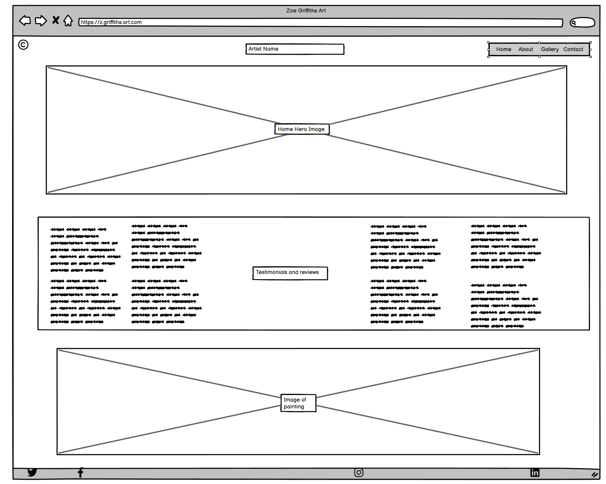

# Zoe Griffiths Art Page

View the live project here.

---

This is the main marketing website for an artist. It is designed to be responsibe and accessible on a range of devices, making it easy to navigate for potential customers and other artists.

# Site Info

This website functions as a comprehensive portfolio for an artist, offering clear insights into the creator's background alongside a showcase of their artistic endeavors. The inclusion of a dedicated contact page facilitates direct communication with the artist, catering to potential commissioners and fellow artists who might be interested in collaboration. The website provides a customisable platform beyond the constraints of standard formats on platforms like Instagram or TikTok.

The design philosophy prioritises simplicity, opting for a minimalistic approach and subtle colour themes to ensure the users attention is solely on the artists work. The overarching goal is to offer visitors pertinent information about the artist, an immersive exploration of their portfolio and an open invitation for communication if they wish to connect.

# User Experience (UX)

## User stories

### First Time Visitor Goals

- **As a First Time Visitor**, I want to easily understand the main purpose of the site and learn more about the artist and their work.
- **As a First Time Visitor**, I want to be able to easily navigate throughout the site to find content and view the artist's work.
- **As a First Time Visitor**, I want to locate their social media links to explore more artwork and engage with the artist's community.

### Returning Visitor Goals

- **As a Returning Visitor**, I want to explore the gallery section to view new artwork.
- **As a Returning Visitor**, I want to contact the artist for commissioning artwork or ask questions.
- **As a Returning Visitor**, I want to find links to the artist's social media platforms to follow their updates and new artworks.

## Design

### Colour Scheme

In crafting the colour scheme for this website, a thoughtful selection of colours was made to ensure a sleek and visually appealing presentation. The chosen palette, comprising of soft greys and whites, was curated to strike a harmonious balance. The use of light greys provides a clean and modern backdrop, allowing the vibrant artworks to take center stage without distraction.

### Typography

The typography of the website embodies a basic, modern and sleek aesthetic, enchancing the overall visual appeal. The site predominantly utilizes the clean and contemporary Roboto font for body text and various sections, maintaining readability across devices. The header features Roboto with a weight of 600, ensuring a distinct appearance, while navigation menu links, set in Roboto with a weight of 500, offer a balanced and easily navigable experience. Consistency in font choices, letter-spacing, and line-height is evident in bio sections, contributing to a well-organised presentation.

### Imagery

Visuals play a crucial role, particularly showcasing artworks in high quality to captivate the audience. Emphasis is on showcasing a diverse range of art pieces through the gallery section.

## Wireframes

I used [Balsamiq](http://balsamiq.com/) to sketch the wireframes and start having a general idea of how the website would have looked like. There have been deviations from the original ideas, such as:

- the use of a testimonials and reviews section;
- using an image of the artist on the contact page;
- the position of the social media icons.

Below, a showcase of the desktop, tablet and mobile wireframes.

#### Desktop Version

Homepage

- [Home Page Wireframe - View](link)
- [Mobile Wireframe - View](link)
- [Contact Us Page Wireframe - View](link)

## Features

- Responsive design adaptable to various screen sizes.
- Interactive gallery showcasing artworks.
- Social media intergration to connect with the artist's community.

## Technologies Used

### Languages Used

- HTML5
- CSS

### Frameworks, Libraries & Programs Used

## Testing

- W3C Markup Validator - [Results](link)
- W3C CSS Validator - [Results](link)

## Testing User Stories from User Experience (UX) Section

### First Time Visitor Goals

- (Content)

### Returning Visitor Goals

- (Content)

### Frequent User Goals

- (Content)

## Further Testing

- The Website was tested on Google Chrome, Internet Explorer, Microsoft Edge and Safari browsers.
- (More details)

## Known Bugs

- (Content)

## Deployment

- GitHub Pages
- Forking the GitHub Repository
- Making a Local Clone

## Credits

### Code

- The full-screen hero image code came from this StackOverflow post.
- Bootstrap4

### Content

- All content was written by the developer.
- Psychological properties of colours text in the README.md was found [here](link).

### Media

- All Images were created by the developer.

## Acknowledgements
