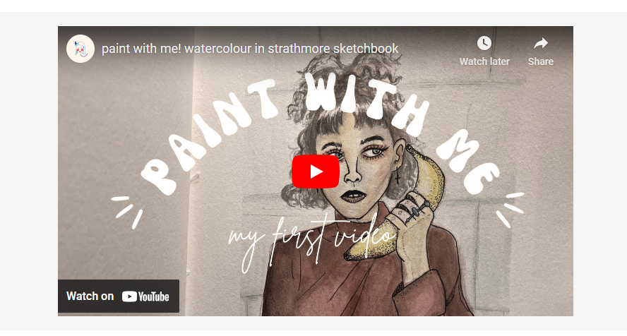
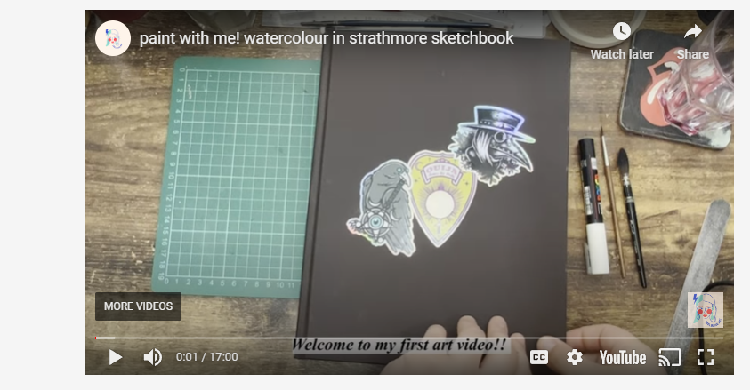

# Zoe Griffiths Art Page

View the live project [here](https://lewis-creates.github.io/z-griffiths/).

## Table of Contents

- [Zoe Griffiths Art Page](#zoe-griffiths-art-page)
  - [Table of Contents](#table-of-contents)
- [Site Info](#site-info)
  - [Project Goals](#project-goals)
    - [User Goals](#user-goals)
    - [Site Owner Goals](#site-owner-goals)
  - [User Experience](#user-experience)
    - [Target Audience](#target-audience)
    - [User Requirements and Expectations](#user-requirements-and-expectations)
    - [User Stories](#user-stories)
      - [First Time User](#first-time-user)
      - [Returning User](#returning-user)
  - [Design](#design)
    - [Design Choices](#design-choices)
    - [Colour Scheme](#colour-scheme)
    - [Typography](#typography)
    - [Imagery](#imagery)
    - [Structure](#structure)
      - [Homepage](#homepage)
      - [Gallery](#gallery)
      - [Contact](#contact)
      - [Confirmation Page](#confirmation-page)
  - [Wireframes](#wireframes)
      - [Desktop Version](#desktop-version)
      - [Tablet Version](#tablet-version)
      - [Smartphone Version](#smartphone-version)
  - [Technologies Used](#technologies-used)
    - [Languages](#languages)
    - [Frameworks \& Tools](#frameworks--tools)
  - [Features](#features)
    - [Navigation Bar](#navigation-bar)
    - [Landing Page Image](#landing-page-image)
    - [Hover On Image](#hover-on-image)
    - [Biography Paragraphs \& Teaser Images](#biography-paragraphs--teaser-images)
    - [Social Media Links](#social-media-links)
    - [Gallery](#gallery-1)
    - [Contact Form](#contact-form)
    - [Form Submission Page](#form-submission-page)
    - [Video](#video)
  - [Validation](#validation)
    - [HTML \& CSS Validation](#html--css-validation)
    - [Lighthouse Validation](#lighthouse-validation)
  - [Testing User Stories](#testing-user-stories)
    - [Returning Visitor Goals](#returning-visitor-goals)
    - [Frequent User Goals](#frequent-user-goals)
  - [Further Testing](#further-testing)
  - [Known Bugs](#known-bugs)
  - [Deployment](#deployment)
  - [Credits](#credits)
    - [Code](#code)
    - [Content](#content)
    - [Media](#media)
  - [Acknowledgements](#acknowledgements)

---

This is the main marketing website for an artist. It is designed to be responsibe and accessible on a range of devices, making it easy to navigate for potential customers and other artists.

# Site Info

This website functions as a comprehensive portfolio for an artist, offering clear insights into the creator's background alongside a showcase of their artistic endeavors. The inclusion of a dedicated contact page facilitates direct communication with the artist, catering to potential commissioners and fellow artists who might be interested in collaboration. The website provides a customisable platform beyond the constraints of standard formats on platforms like Instagram or TikTok.

The design philosophy prioritises simplicity, opting for a minimalistic approach and subtle colour themes to ensure the users attention is solely on the artists work. The overarching goal is to offer visitors pertinent information about the artist, an immersive exploration of their portfolio and an open invitation for communication if they wish to connect.

## Project Goals

### User Goals

- Discovering a captivating online platform for exploring Zoe Griffiths' art portfolio.
- Exploring avenues to contact the artist for inquiries or purchases.
- Accessing information about the artist.

### Site Owner Goals

- Attracting and expanding the audience for the artists portfolio.
- Effectively promoting the artists work and the online platform.
- Facilitating communication between the artist and potential clients.
   
   
   

## User Experience

### Target Audience

- Art lovers looking for inspiration.
- Enthusiasts and collectors of unique artwork.
- Potential buyers.
- Fellow artists looking to collaborate.

### User Requirements and Expectations

- A simple, sleek and intuitive navigation system.
- Links and functions that work as expected.
- A visually appealing and responsive website.
- A good level of accessibility.

### User Stories

#### First Time User

1. As a first time user, I want to know quickly what the website is about.
2. As a first time user, I want to easily understand how to navigate the website.
3. As a first time user, I want to locate their social media links to explore more artwork.

#### Returning User

1. As a returning user, I want to explore the gallery to view new artwork.
2. As a returning user, I want to contact the artist for commissioning artwork or ask questions.
3. As a returning user, I want to find links to the artist's social media platforms to follow their updates.
    
    
    

## Design

### Design Choices

The website has been designed choosing a minimal style, clear and user friendly. Borders - when present - are neat and light. Pages are not filled with unnecessary information. The overall design choice is subtle and light.

### Colour Scheme

In crafting the colour scheme for this website, a thoughtful selection of colours was made to ensure a sleek and visually appealing presentation. The chosen palette, comprising of soft greys and whites, was curated to strike a harmonious balance. The use of light greys provides a clean and modern backdrop, allowing the vibrant artworks to take center stage without distraction.

### Typography

The typography of the website embodies a basic, modern and sleek aesthetic, enchancing the overall visual appeal. The site predominantly utilizes the clean and contemporary Roboto font for body text and various sections, maintaining readability across devices. The header features Roboto with a weight of 600, ensuring a distinct appearance, while navigation menu links, set in Roboto with a weight of 500, offer a balanced and easily navigable experience. Consistency in font choices, letter-spacing, and line-height is evident in bio sections, contributing to a well-organised presentation.

### Imagery

Visuals play a crucial role, particularly showcasing artworks in high quality to captivate the audience. Emphasis is on showcasing a diverse range of art pieces through the gallery section.

### Structure

The website is easy to navigate, essential, hence user friendly. It consists of four separate pages:

#### Homepage

A landing page with two text containers and a few teaser images.

#### Gallery

A page with a list of images of the artists work.

#### Contact

A page with a contact form for people to get in touch with the artist.

#### Confirmation Page

A page with a confirmation message after submission of the contact form.

## Wireframes

I used [Balsamiq](http://balsamiq.com/) to sketch the wireframes and start having a general idea of how the website would have looked like. There have been deviations from the original ideas, such as:

- the use of a testimonials and reviews section;
- using an image of the artist on the contact page;
- the position of the social media icons.

Below, a showcase of the desktop, tablet and mobile wireframes.

#### Desktop Version

Homepage

Gallery

Contact

#### Tablet Version

Homepage

Gallery

Contact

#### Smartphone Version

Homepage

Gallery

Contact

 
 
 

## Technologies Used

### Languages

- HTML
- CSS

### Frameworks & Tools
- [GitHub](https://github.com/)
- [Balsamiq](https://balsamiq.com/)
- [Google Fonts](https://fonts.google.com/)
- [Am I Responsive?](https://ui.dev/amiresponsive)
- [YouTube](https://www.youtube.com/)
- [Bootstrap](https://getbootstrap.com/)

## Features

The page consists of three pages (plus the confirmation page).

### Navigation Bar

- Featured on all four pages;
- The navbar is fully responsive; the display links to Home page, Gallery and Contact page;
- It allows users to easily navigate the page;
- The links are hover responsive to increase user feedback and also display which page is active to decrease chances of confusion;

 
_Here, for example, The "Home" is highlighted, this is to display which page is active to decrease the chances of confusion._

 
 

### Landing Page Image

- Featured on all four pages;
- Catches the users attention due to its animation;
- Lets the users understand what the page is about;

 

### Hover On Image

- The teaser images and the gallery images have a hover expand animation.
- This is to bring more attention to the image

 

### Biography Paragraphs & Teaser Images

- The content on the homepage consists of paragraphs of information about the artist split up with teaser images.
- The bio paragraphs are intended to teach the visitor about the artist and their background. It also serves as an outline of the site purpose and what the visitor can expect.
- Teaser images are inserted with the goal of enticing the visitor to explore the gallery section, where they can see these in more detail.

 

### Social Media Links

- The bottom of all pages contains links to Instagram, Twitter, TikTok and LinkedIn, where further work is hosted.
- These include hover responsivness to improve user feedback.

 

### Gallery

- The gallery will show examples of visual work completed by the artist.
- All images have some dark padding around the edges, intended to frame the images against the background.
- Incorporated the hr rule in the gallery section to enhance the visual appeal by creating a clear separation between images, providing a structured and aesthetically pleasing layout.

 

### Contact Form

- The contact form is on the 'contact' page and provides an opportunity for visitors to get in touch with the artist, allowing space for them to leave name, email address and a message.
- The form also contains required fields so the visitor cannot submit an empty form.
- The email input must contain a properly formatted email address.

 

### Form Submission Page

- This pages confirms with the visitor that their form has been submitted.
- It also lets them know they will get a response and they can navigate back using the nav bar in the header.

 

### Video

- Embedded YouTube video that seamlessly integrates into the website, offering an immersive multimedia experience. 
- Allows visiors to take control of tehir experience by initiating the playback of the embedded video, ensuring a user-centric approach to content consumption.
- Enchances the site's richness with a dynamic YouTube video component, adding visual appeal.

 

_Here, for example, you can see the controls, with no autoplay._
 

## Validation

### HTML & CSS Validation

- W3C Markup Validator - [Results](https://validator.w3.org/nu/?doc=https%3A%2F%2Flewis-creates.github.io%2Fz-griffiths%2F)
- W3C CSS Validator - [Results](https://jigsaw.w3.org/css-validator/validator?uri=https%3A%2F%2Flewis-creates.github.io%2Fz-griffiths&profile=css3svg&usermedium=all&warning=1&vextwarning=&lang=en)
 

### Lighthouse Validation
Google Lighthouse was used to test performance, accessibility, best practices and SEO (Search Engine Optimisation) of the website.

- Testing using Lighthouse tool in Chrome Developer tools provided a decent score but also suggested to improve:
    - Properly sizing images and serving them in a next-gen format to decrease load time for users.
    - Optimise website performance by addressing render-blocking resources.
    - Enhance website loading performance by reducing unused CSS eliminate or defer styles not crucial for above-the-fold content, potentially saving significant bytes transferred over the network.
    - Some links do not have discernible names.
- The links were changed to include aria-labels, this increased the accessibility to a perfect score.

## Testing User Stories

**First time user**

1. As a first time user, I want to know quickly what the website is about.

| **Feature** | **Action** | **Expected Result** | **Actual Result** |
|-------------|------------|---------------------|-------------------|
| Landing page image | Land on the Homepage, first visible image | Seeing the image of paintbrushes, letting you know it is a art page | Works as expected |
| Bio paragraph | Land on the Homepage, navigate to the bio paragraph | Read an introductive text about the website | Works as expected |

Screenshots

 

2. As a first time user, I want to easily understand how to navigate the website.

| **Feature** | **Action** | **Expected Result** | **Actual Result** |
|-------------|------------|---------------------|-------------------|
| Navigation Bar | Look and click/tap on the elements | Have a quick knowledge of the pages | Works as expected |

Screenshot

 

**Returning user**

1. As a returning user, I want to explore the gallery to view new artwork.

| **Feature** | **Action** | **Expected Result** | **Actual Result** |
|-------------|------------|---------------------|-------------------|
| Gallery | Navigate to the gallery page using the navbar and see the images | Able to view artwork by the artist | Works as expected |

Screenshot

 

2. As a returning user, I want to contact the artist for commissioning artwork or ask questions.

| **Feature** | **Action** | **Expected Result** | **Actual Result** |
|-------------|------------|---------------------|-------------------|
| Contact Form | Navigate to the contact page using the navbar, fill in the contact form | Form will be submitted, artist will be in touch | Works as expected |

- (Content)

### Returning Visitor Goals

- (Content)

### Frequent User Goals

- (Content)

## Further Testing

- The Website was tested on Google Chrome, Internet Explorer, Microsoft Edge and Safari browsers.
- (More details)

## Known Bugs

- (Content)

## Deployment

- GitHub Pages
- Forking the GitHub Repository
- Making a Local Clone

## Credits

### Code

- The full-screen hero image code came from this StackOverflow post.
- Bootstrap4

### Content

- All content was written by the developer.
- Psychological properties of colours text in the README.md was found [here](link).

### Media

- All Images were created by the developer.

## Acknowledgements
